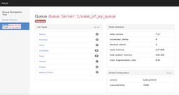
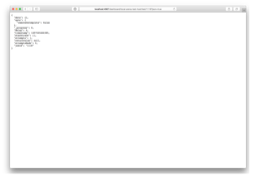

# Arena

[](https://www.npmjs.com/package/bull-arena) [](https://github.com/prettier/prettier) [](https://www.npmjs.com/package/bull-arena) [](https://github.com/semantic-release/semantic-release)

An intuitive Web GUI for [Bee Queue](https://github.com/bee-queue/bee-queue), [Bull](https://github.com/optimalbits/bull) and [BullMQ](https://github.com/taskforcesh/bullmq). Built on Express so you can run Arena standalone, or mounted in another app as middleware.

For a quick introduction to the motivations for creating Arena, read _[Interactively monitoring Bull, a Redis-backed job queue for Node](https://www.mixmax.com/blog/introducing-bull-arena)_.

### Screenshots

[](screenshots/screen1.png) [](screenshots/screen2.png) [](screenshots/screen3.png)

### Features

- Check the health of a queue and its jobs at a glance
- Paginate and filter jobs by their state
- View details and stacktraces of jobs with permalinks
- Restart and retry jobs with one click

### Usage

Arena accepts the following options:

```js
const Arena = require('bull-arena');

// Mandatory import of queue library.
const Bee = require('bee-queue');

Arena({
  // All queue libraries used must be explicitly imported and included.
  Bee,

  // Provide a `Bull` option when using bull, similar to the `Bee` option above.

  queues: [
    {
      // Required for each queue definition.
      name: 'name_of_my_queue',

      // User-readable display name for the host. Required.
      hostId: 'Queue Server 1',

      // Queue type (Bull or Bee - default Bull).
      type: 'bee',

      // Queue key prefix. Defaults to "bq" for Bee and "bull" for Bull.
      prefix: 'foo',
    },
  ],

  // Optionally include your own stylesheet
  customCssPath: 'https://example.com/custom-arena-styles.css',

  // Optionally include your own script
  customJsPath: 'https://example.com/custom-arena-js.js',
});
```

The required `name` and `hostId` in each queue object have to be present in each queue object. Additional keys can be present in them, to configure the redis client itself.

The three ways in which you can configure the client are:

#### 1. port/host

```jsonc
// In a queue object.
{
  // Hostname or IP. Required.
  "host": "127.0.0.1",

  // Bound port. Optional, default: 6379.
  "port": 6379,

  // Optional, to issue a redis AUTH command.
  "password": "hello",

  // Optional; default 0. Most of the time, you'll leave this absent.
  "db": 1
}
```

#### 2. URL

You can also provide a `url` field instead of `host`, `port`, `db` and `password`.

```js
{
  "url": "[redis:]//[[user][:password@]][host][:port][/db-number][?db=db-number[&password=bar[&option=value]]]"
}
```

#### 3. Redis client options

Arena is compatible with both Bee and Bull.
If you need to pass some specific configuration options directly to the redis client library your queue uses, you can also do so.

Bee uses node [redis](https://www.npmjs.com/package/redis) client, Bull uses [ioredis](https://www.npmjs.com/package/ioredis) client.
These clients expect different configurations options.

```js
{
  "redis": {}
}
```

For Bee, the `redis` key will be directly passed to [`redis.createClient`](https://github.com/NodeRedis/node_redis#rediscreateclient), as explained [here](https://github.com/bee-queue/bee-queue#settings).

For Bull, the `redis` key will be directly passed to [`ioredis`](https://github.com/luin/ioredis/blob/master/API.md#new_Redis_new), as explained [here](https://github.com/OptimalBits/bull/blob/master/REFERENCE.md#queue). To use this to connect to a Sentinel cluster, see [here](https://github.com/luin/ioredis/blob/master/README.md#sentinel).

#### Custom configuration file

To specify a custom configuration file location, see [Running Arena as a node module](#running-arena-as-a-node-module).

_Note that if you happen to use Amazon Web Services' ElastiCache as your Redis host, check out http://mixmax.com/blog/bull-queue-aws-autodiscovery_

#### Running Arena as a node module

See the [Docker image](#docker-image) section or the [docker-arena] repository for information about running this standalone.

Note that because Arena is implemented using `async`/`await`, Arena only currently supports Node `>=7.6`.

Using Arena as a node module has potential benefits:

- Arena can be configured to use any method of server/queue configuration desired
  - for example, fetching available redis queues from an AWS instance on server start
  - or even just plain old reading from environment variables
- Arena can be mounted in other express apps as middleware

Usage:

In project folder:

```shell
$ npm install bull-arena
```

In router.js:

```js
const Arena = require('bull-arena');

const express = require('express');
const router = express.Router();

const arena = Arena({
  // Include a reference to the bee-queue or bull libraries, depending on the library being used.

  queues: [
    {
      // First queue configuration
    },
    {
      // Second queue configuration
    },
    {
      // And so on...
    },
  ],
});

router.use('/', arena);
```

`Arena` takes two arguments. The first, `config`, is a plain object containing the [queue configuration, flow configuration (just for bullmq for now) and other optional parameters](#usage). The second, `listenOpts`, is an object that can contain the following optional parameters:

- `port` - specify custom port to listen on (default: 4567)
- `host` - specify custom ip to listen on (default: '0.0.0.0')
- `basePath` - specify custom path to mount server on (default: '/')
- `disableListen` - don't let the server listen (useful when mounting Arena as a sub-app of another Express app) (default: false)
- `useCdn` - set false to use the bundled js and css files (default: true)
- `customCssPath` - an URL to an external stylesheet (default: null)

##### Example config (for bull)

```js
import Arena from 'bull-arena';
import Bull from 'bull';

const arenaConfig = Arena({
  Bull,
  queues: [
    {
      type: 'bull',

      // Name of the bull queue, this name must match up exactly with what you've defined in bull.
      name: "Notification_Emailer",

      // Hostname or queue prefix, you can put whatever you want.
      hostId: "MyAwesomeQueues",

      // Redis auth.
      redis: {
        port: /* Your redis port */,
        host: /* Your redis host domain*/,
        password: /* Your redis password */,
      },
    },
  ],

  // Optionally include your own stylesheet
  customCssPath: 'https://example.com/custom-arena-styles.css',

  // Optionally include your own script
  customJsPath: 'https://example.com/custom-arena-js.js',
},
{
  // Make the arena dashboard become available at {my-site.com}/arena.
  basePath: '/arena',

  // Let express handle the listening.
  disableListen: true,
});

// Make arena's resources (js/css deps) available at the base app route
app.use('/', arenaConfig);
```

(Credit to [tim-soft](https://github.com/tim-soft) for the example config.)

##### Example config (for bullmq)

```js
import Arena from 'bull-arena';
import { Queue, FlowProducer } from "bullmq";

const arenaConfig = Arena({
  BullMQ: Queue,
  FlowBullMQ: FlowProducer,
  queues: [
    {
      type: 'bullmq',

      // Name of the bullmq queue, this name must match up exactly with what you've defined in bullmq.
      name: "testQueue",

      // Hostname or queue prefix, you can put whatever you want.
      hostId: "worker",

      // Redis auth.
      redis: {
        port: /* Your redis port */,
        host: /* Your redis host domain*/,
        password: /* Your redis password */,
      },
    },
  ],

  flows: [
    {
      type: 'bullmq',

      // Name of the bullmq flow connection, this name helps to identify different connections.
      name: "testConnection",

      // Hostname, you can put whatever you want.
      hostId: "Flow",

      // Redis auth.
      redis: {
        port: /* Your redis port */,
        host: /* Your redis host domain*/,
        password: /* Your redis password */,
      },
    },
  ],

  // Optionally include your own stylesheet
  customCssPath: 'https://example.com/custom-arena-styles.css',

  // Optionally include your own script
  customJsPath: 'https://example.com/custom-arena-js.js',
},
{
  // Make the arena dashboard become available at {my-site.com}/arena.
  basePath: '/arena',

  // Let express handle the listening.
  disableListen: true,
});

// Make arena's resources (js/css deps) available at the base app route
app.use('/', arenaConfig);
```

### Bee Queue support

Arena is dual-compatible with Bull 3.x and Bee-Queue 1.x. To add a Bee queue to the Arena dashboard, include the `type: 'bee'` property with an individual queue's configuration object.

### BullMQ Queue support

Arena has added preliminary support for BullMQ post 3.4.x version. To add a BullMQ queue to the Arena dashboard, include the `type: 'bullmq'` property with an individual queue's configuration object.

### Docker image

You can `docker pull` Arena from [Docker Hub](https://hub.docker.com/r/mixmaxhq/arena/).

Please see the [docker-arena] repository for details.

### Official UIs

- [Taskforce](https://taskforce.sh) for Bull and Bullmq

### Contributing

See [contributing guidelines](CONTRIBUTING.md) and [an example](example/README.md).

### License

The [MIT License](LICENSE).

[docker-arena]: https://github.com/bee-queue/docker-arena


# Cloudways
## Folder structure on server

#### Staging:
```
/var/www/html/event_service_monitoring/

clone the repo with folder name bull_mon_stg

git clone https://github.com/a-samad/arena.git
```

#### Production
```
/var/www/html/event_service_monitoring/
git clone the repo with folder name bull_mon_prod
```

## Docker Build and Run Commands

    Node9 Docker image: https://hub.docker.com/layers/library/node/9.0/images/sha256-e9d9f6d34ed21ba709ceeff5a6e27fb021561b3aa4b37fa70575d85fef77e9fd?context=explore
    
    With docker-compose.yaml
    Add env variables in this file .env, this should not be the part of GIT repo 
    Port on DEV/STG is 45678
    Port on PROD is 4567

    $ docker-compose build
    $ docker-compose up -d
    $ docker ps
    CONTAINER ID   IMAGE                   COMMAND                  CREATED          STATUS          PORTS                                         NAMES
    bd88e12166a0   bull_mon_stg_bull_mon   "pm2 start server.js…"   11 minutes ago   Up 11 minutes   0.0.0.0:45678->4567/tcp, :::45678->4567/tcp   bull_mon_stg_bull_mon_1

    Without docker-compose.yaml
    $ docker build -t bull_mon .
    $ docker run -it -d --name cw_event_service_mon bull_mon

    $ docker ps
    CONTAINER ID   IMAGE      COMMAND                  CREATED         STATUS         PORTS      NAMES
    5b017ecb71a4   bull_mon   "pm2 start index.js …"   2 seconds ago   Up 2 seconds   4567/tcp   cw_event_service_mon